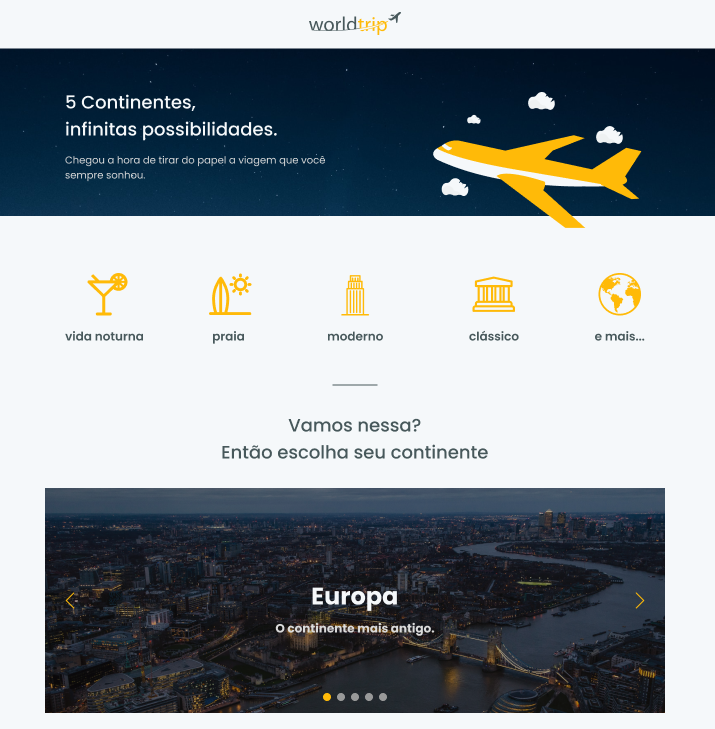

<h1 align="center">   </h1>

<h1 align="center"> 🗺️ Worldtrip ✈️ </h1>

<p align="center">
   
    
  
  
  
  
</p>

<br>

# 👩‍💻 About
<p align="justify">Welcome to our worldtrip travel app where you'll find lots of inspiration for your next trip.  In this challenge, our main goal is to build a web application from scratch with ReactJS, NextJS and Chakra UI according to Figma layout. 
</p>

<br>

# 🎨 Layout

<div align="center">
  <p align="center">
    
  </p>
</div>

<br>

# 📽️ Demo

<div align="center">
  <p align="center">
    
  </p>
</div>

<br>

# :rocket: Tecnologies
- [ReactJS](https://reactjs.org/)
- [NextJS](https://nextjs.org/)
- [TypeScript](https://www.typescriptlang.org/)
- [Swiper](https://swiperjs.com/react)
- [Prismic CMS](https://prismic.io/docs)
- [React Icons](https://react-icons.github.io/react-icons/)
- [SASS](https://sass-lang.com/)
- [Chackra UI](https://chakra-ui.com/)

<br>

# 🔧 Run Locally

Clone the project

```bash
  git clone git@github.com:https://github.com/Joseane-Guedes/ignite-worldtrip-challenge6
```

Go to the project directory

```bash
  cd ignite-worldtrip-challenge6
```

Install dependencies

```bash
  yarn
```

Start the server

```bash
  yarn dev
```
# :closed_book: License

Released in 2021 :closed_book: License

This project is under the [MIT license](./LICENSE).

#

<!-- <p align="center">
   <b> &#60;/&#62; by <a href="https://www.linkedin.com/in/joseane-guedes/">Joseane Guedes</a></b>
</p> -->

Made with :purple_heart: by [Rocketseat](https://rocketseat.com.br/ignite) :rocket: and [Joseane Guedes ](https://github.com/Joseane-Guedes) :woman_technologist:


